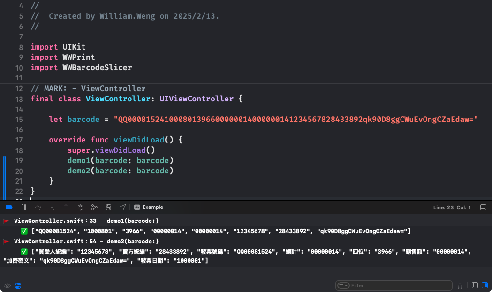

# WWBarcodeSlicer
[](https://developer.apple.com/swift/) [](https://developer.apple.com/swift/)  [](https://developer.apple.com/swift/) [](https://developer.apple.com/swift/)

### [Introduction - 簡介](https://swiftpackageindex.com/William-Weng)
- [Barcode text splitter, a function used to process Barcode text.](https://www.einvoice.nat.gov.tw/static/ptl/ein_upload/attachments/1479449792874_0.6(20161115).pdf)
- Barcode文字分割器，用來處理Barcode文字的功能。



### [Installation with Swift Package Manager](https://medium.com/彼得潘的-swift-ios-app-開發問題解答集/使用-spm-安裝第三方套件-xcode-11-新功能-2c4ffcf85b4b)
```bash
dependencies: [
    .package(url: "https://github.com/William-Weng/WWBarcodeSlicer.git", .upToNextMajor(from: "1.0.0"))
]
```

### Function - 可用函式
|函式|功能|
|-|-|
|parse(_:counts:)|解析Barcode => [String]|
|parse(_:infos:)|解析Barcode => [String:String]|

### Example
```swift
import UIKit
import WWPrint
import WWBarcodeSlicer

final class ViewController: UIViewController {

    let barcode = "QQ000815241000801396600000014000000141234567828433892qk90D8ggCWuEvOngCZaEdaw="
        
    override func viewDidLoad() {
        super.viewDidLoad()
        
        let counts = [10, 7, 4, 8, 8, 8, 8, 24]
        
        let infos: [WWBarcodeSlicer.BarcodeInfo] = [
            (key: "發票號碼", count: 10),
            (key: "發票日期", count: 7),
            (key: "四位", count: 4),
            (key: "銷售額", count: 8),
            (key: "總計", count: 8),
            (key: "買受人統編", count: 8),
            (key: "賣方統編", count: 8),
            (key: "加密密文", count: 24),
        ]
        
        let dict = WWBarcodeSlicer.shared.parse(barcode, infos: infos)
        let codes = WWBarcodeSlicer.shared.parse(barcode, counts: counts)

        wwPrint(dict)
        wwPrint(codes)
    }
}
```
